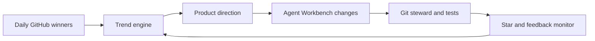

# Agent Workbench

[中文完整版](README.zh-CN.md) | [English introduction](#english-introduction)

## 中文介绍

用一条命令把任意代码仓库变成 AI coding agent 可以安全接手的工作区。

Agent Workbench 是一个 provider-neutral 的 Python CLI。它会扫描仓库结构、包管理器、测试命令和本地风险信号，然后生成两份可直接交给 coding agent 的 Markdown 文件：

- `AGENTS.md`：仓库地图、安全命令、高信号文件和操作护栏。
- `agent-task-pack.md`：首批任务、验收门槛和交付前检查清单。

默认输出不绑定任何模型或工具；需要时也可以额外生成 Claude Code、Codex、Cursor 和 OpenCode 的轻量 handoff 文件。

```powershell
uv run --python 3.12 python -m agent_workbench init . --output .agent-workbench --project-name my-repo
```

## English Introduction

Turn any repository into an AI-agent-ready workspace with one command.

```text
$ agent-workbench demo
Demo repository: .../agent-workbench-demo/sample-repo
Wrote .../agent-workbench-demo/.agent-workbench/AGENTS.md
Wrote .../agent-workbench-demo/.agent-workbench/agent-task-pack.md

$ tree .agent-workbench
.agent-workbench
|-- AGENTS.md
`-- agent-task-pack.md
```

Agent Workbench scans a codebase and writes the two files a coding agent needs before it can work safely:

- `AGENTS.md`: repository map, safe commands, high-signal files, and guardrails.
- `agent-task-pack.md`: first jobs and acceptance gates for agent-driven edits.
- Existing agent assets: detects files like `AGENTS.md`, `CLAUDE.md`, `.codex/AGENTS.md`, `.cursor/rules/*.md`, `.github/copilot-instructions.md`, `GEMINI.md`, and `opencode.json`.

It is provider-neutral by default. Optional adapters can also generate thin handoff files for Claude Code, Codex, Cursor, and OpenCode without changing the core Markdown output.

## What You Get

```text
.agent-workbench/
  AGENTS.md
  agent-task-pack.md
```

Example `AGENTS.md` output:

```markdown
## Repository Map

- Files scanned: 56
- Main file kinds: python=31, config=9, docs=5
- Package managers: python/pyproject

## Existing Agent Assets

- GitHub Copilot instructions: `.github/copilot-instructions.md`

## Safe Commands

- `python -m unittest discover -s tests`

## Guardrails

- .env.local exists; keep it ignored and never paste secrets into issues.
```

The goal is boringly useful: give an agent enough local context to start small, verify changes, and avoid obvious mistakes.

## Real Examples

See tiny repositories before and after Agent Workbench:

- Python input: [`examples/python-cli/source`](examples/python-cli/source)
- Python `AGENTS.md`: [`examples/python-cli/agent-workbench/AGENTS.md`](examples/python-cli/agent-workbench/AGENTS.md)
- Python task pack: [`examples/python-cli/agent-workbench/agent-task-pack.md`](examples/python-cli/agent-workbench/agent-task-pack.md)
- TypeScript input: [`examples/typescript-cli/source`](examples/typescript-cli/source)
- TypeScript `AGENTS.md`: [`examples/typescript-cli/agent-workbench/AGENTS.md`](examples/typescript-cli/agent-workbench/AGENTS.md)
- TypeScript task pack: [`examples/typescript-cli/agent-workbench/agent-task-pack.md`](examples/typescript-cli/agent-workbench/agent-task-pack.md)

Example `agent-task-pack.md` output:

```markdown
## Kickoff Prompt

You are working in my-repo. Read AGENTS.md first, inspect `README.md`, make one small improvement, and verify it before summarizing the change.

## Verification Commands

- `python -m unittest discover -s tests`

## High-Signal Files

- `README.md` (docs, 40 lines)
```

## Quick Start

Install directly from GitHub:

```powershell
uv tool install git+https://github.com/Xiao-rx/agent-workbench.git
agent-workbench demo --adapter all --check --print-kickoff
```

Try the no-secret demo first:

```powershell
$env:UV_CACHE_DIR='.uv-cache'
$env:UV_PYTHON_INSTALL_DIR='.uv-python'
$env:PYTHONPATH='src'
uv run --python 3.12 python -m agent_workbench demo --adapter all --check --print-kickoff
```

Text output prints a `Proof:` line with the same copyable summary as JSON, including adapter and existing agent asset counts, so the first run is easy to screenshot or paste into an issue.
The demo repository includes a safe `.github/copilot-instructions.md`, so the generated workbench shows how existing agent assets are detected.

Generate a machine-readable demo proof:

```powershell
agent-workbench demo --adapter all --check --format json --output-json .agent-workbench/demo-proof.json
```

The JSON proof includes the written files, a compact artifact summary, existing `agent_assets`, a copyable `proof_summary`, the first verification command when available, the kickoff prompt, and optional readiness.
Scan JSON also includes `agent_assets`, so downstream harnesses can tell whether a repository already carries Claude, Codex, Cursor, Copilot, Gemini, or OpenCode guidance.

Generate files for your current repository:

```powershell
uv run --python 3.12 python -m agent_workbench init . --output .agent-workbench --project-name my-repo --check
```

Generate a machine-readable init proof:

```powershell
agent-workbench init . --output .agent-workbench --adapter all --check --format json --output-json .agent-workbench/init-proof.json
```

Generate optional Claude Code, Codex, Cursor, and OpenCode adapters:

```powershell
uv run --python 3.12 python -m agent_workbench init . --output .agent-workbench --adapter all
```

Inspect a repository before generating files:

```powershell
uv run --python 3.12 python -m agent_workbench scan .
uv run --python 3.12 python -m agent_workbench scan . --format json
uv run --python 3.12 python -m agent_workbench scan . --format json --output-json .agent-workbench/repo-map.json
```

Check whether a repository already has an agent-ready workbench:

```powershell
agent-workbench check .
agent-workbench check . --format json
agent-workbench check . --strict --format json
agent-workbench check . --adapter all --format json
agent-workbench check . --format json --output-json .agent-workbench/readiness.json
```

`check` also validates optional Claude Code, Codex, Cursor, and OpenCode handoff files when they are present. Use `--adapter all` to require all four handoffs.
Use `--strict` in CI when warnings, such as missing `.gitignore` or local secret-risk files, should make the repository `not_ready`.
JSON readiness reports include `next_action`, so downstream agent harnesses can route ready, failed, and warning-only workspaces without parsing human text.

Run tests:

```powershell
$env:UV_CACHE_DIR='.uv-cache'; $env:UV_PYTHON_INSTALL_DIR='.uv-python'; $env:PYTHONPATH='src'; uv run --python 3.12 python -m unittest discover -s tests
```

## Why This Exists

AI coding agents fail less when the repository gives them a short, accurate operating manual. Most projects do not have one. Agent Workbench builds that first manual automatically from repository structure, package markers, test commands, and local risk signals.

The goal is not to be another agent. The goal is to make every repository easier for agents to enter, change, verify, and leave clean.

## Why It Travels Well

- No runtime dependencies.
- No model or provider lock-in.
- No secrets required for the product CLI.
- Works before you choose an agent tool.
- Shows Python and TypeScript proof paths.
- Produces plain Markdown that humans can review.

## Commands

```text
agent-workbench demo [--output PATH] [--adapter claude|codex|cursor|opencode|all] [--check] [--print-kickoff] [--format text|json] [--output-json PATH]
agent-workbench scan [ROOT] [--format text|json] [--output-json PATH]
agent-workbench check [ROOT] [--workbench PATH] [--adapter claude|codex|cursor|opencode|all] [--strict] [--format text|json] [--output-json PATH]
agent-workbench init [ROOT] --output .agent-workbench --project-name NAME [--adapter claude|codex|cursor|opencode|all] [--check] [--print-kickoff] [--format text|json] [--output-json PATH]

python -m agent_workbench scan [ROOT] [--format text|json] [--output-json PATH]
python -m agent_workbench check [ROOT] [--workbench PATH] [--adapter claude|codex|cursor|opencode|all] [--strict] [--format text|json] [--output-json PATH]
python -m agent_workbench init [ROOT] --output .agent-workbench --project-name NAME [--adapter claude|codex|cursor|opencode|all] [--check] [--print-kickoff] [--format text|json] [--output-json PATH]
python -m agent_workbench demo [--output PATH] [--adapter claude|codex|cursor|opencode|all] [--check] [--print-kickoff] [--format text|json] [--output-json PATH]
```

## Release

- Next release notes: [`docs/release-v0.8.0.md`](docs/release-v0.8.0.md)
- Latest published release: [`v0.7.0`](https://github.com/Xiao-rx/agent-workbench/releases/tag/v0.7.0)
- Launch kit: [`docs/launch-kit.md`](docs/launch-kit.md)
- Install from GitHub: `uv tool install git+https://github.com/Xiao-rx/agent-workbench.git`

The internal trend engine remains available for growth experiments:

```text
python -m github_trend_lab collect
python -m github_trend_lab history --start 2026-01-01 --end 2026-05-19 --top 5
python -m github_trend_lab monitor --repo OWNER/REPO
python -m github_trend_lab orchestrate --repo OWNER/REPO
python -m github_trend_lab verify
```

The trend engine is not the product. It is the internal growth loop used to decide what Agent Workbench should improve next.

## Feedback Loop



## Current Trend Bet

The current bet is provider-neutral agent enablement:

- Specific audience: developers using coding agents on real repositories.
- One-command value: generate agent handoff docs immediately.
- Measurable proof: files scanned, safe commands found, guardrails written.
- Portable surface: works before choosing Codex, Claude Code, Cursor, or another tool.

The trend engine is deliberately kept in this repository so the product can keep changing as GitHub daily winners shift.

## Credentials

Do not paste tokens into chat or commit them to git.

For local trend runs, put a fine-grained token in `.env.local`:

```env
GITHUB_TOKEN=<your-token>
GITHUB_OWNER=your-user
GITHUB_REPO=agent-workbench
TARGET_REPO=your-user/agent-workbench
```

`.env.local` is ignored by git.

## Publishing

After `.env.local` contains a scoped token, publish with the normal git path:

```powershell
.\scripts\publish.ps1 -Visibility public
```

Verify the remote after publishing:

```powershell
.\scripts\verify_remote.ps1
```
