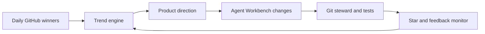

# Agent Workbench

Turn any repository into an AI-agent-ready workspace with one command.

```powershell
uv run --python 3.12 python -m agent_workbench init . --output .agent-workbench --project-name my-repo
```

Agent Workbench scans a codebase and writes the two files a coding agent needs before it can work safely:

- `AGENTS.md`: repository map, safe commands, high-signal files, and guardrails.
- `agent-task-pack.md`: first jobs and acceptance gates for agent-driven edits.

It is provider-neutral: use the generated files with Codex, Claude Code, Cursor, OpenCode, or any agent harness that benefits from a compact repository map.

## What You Get

```text
.agent-workbench/
  AGENTS.md
  agent-task-pack.md
```

Example `AGENTS.md` output:

```markdown
## Repository Map

- Files scanned: 56
- Main file kinds: python=31, config=9, docs=5
- Package managers: python/pyproject

## Safe Commands

- `python -m unittest discover -s tests`

## Guardrails

- .env.local exists; keep it ignored and never paste secrets into issues.
```

The goal is boringly useful: give an agent enough local context to start small, verify changes, and avoid obvious mistakes.

Example `agent-task-pack.md` output:

```markdown
## Kickoff Prompt

You are working in my-repo. Read AGENTS.md first, inspect `README.md`, make one small improvement, and verify it before summarizing the change.

## Verification Commands

- `python -m unittest discover -s tests`

## High-Signal Files

- `README.md` (docs, 40 lines)
```

## Quick Start

Try the no-secret demo first:

```powershell
$env:UV_CACHE_DIR='.uv-cache'
$env:UV_PYTHON_INSTALL_DIR='.uv-python'
$env:PYTHONPATH='src'
uv run --python 3.12 python -m agent_workbench demo
```

Generate files for your current repository:

```powershell
uv run --python 3.12 python -m agent_workbench init . --output .agent-workbench --project-name my-repo
```

Inspect a repository before generating files:

```powershell
uv run --python 3.12 python -m agent_workbench scan .
```

Run tests:

```powershell
$env:UV_CACHE_DIR='.uv-cache'; $env:UV_PYTHON_INSTALL_DIR='.uv-python'; $env:PYTHONPATH='src'; uv run --python 3.12 python -m unittest discover -s tests
```

## Why This Exists

AI coding agents fail less when the repository gives them a short, accurate operating manual. Most projects do not have one. Agent Workbench builds that first manual automatically from repository structure, package markers, test commands, and local risk signals.

The goal is not to be another agent. The goal is to make every repository easier for agents to enter, change, verify, and leave clean.

## Why It Travels Well

- No runtime dependencies.
- No model or provider lock-in.
- No secrets required for the product CLI.
- Works before you choose an agent tool.
- Produces plain Markdown that humans can review.

## Commands

```text
python -m agent_workbench scan [ROOT]
python -m agent_workbench init [ROOT] --output .agent-workbench --project-name NAME
python -m agent_workbench demo [--output PATH]
```

The internal trend engine remains available for growth experiments:

```text
python -m github_trend_lab collect
python -m github_trend_lab history --start 2026-01-01 --end 2026-05-19 --top 5
python -m github_trend_lab monitor --repo OWNER/REPO
python -m github_trend_lab orchestrate --repo OWNER/REPO
python -m github_trend_lab verify
```

The trend engine is not the product. It is the internal growth loop used to decide what Agent Workbench should improve next.

## Feedback Loop



## Current Trend Bet

The current bet is provider-neutral agent enablement:

- Specific audience: developers using coding agents on real repositories.
- One-command value: generate agent handoff docs immediately.
- Measurable proof: files scanned, safe commands found, guardrails written.
- Portable surface: works before choosing Codex, Claude Code, Cursor, or another tool.

The trend engine is deliberately kept in this repository so the product can keep changing as GitHub daily winners shift.

## Credentials

Do not paste tokens into chat or commit them to git.

For local trend runs, put a fine-grained token in `.env.local`:

```env
GITHUB_TOKEN=<your-token>
GITHUB_OWNER=your-user
GITHUB_REPO=agent-workbench
TARGET_REPO=your-user/agent-workbench
```

`.env.local` is ignored by git.

## Publishing

After `.env.local` contains a scoped token, publish with the normal git path:

```powershell
.\scripts\publish.ps1 -Visibility public
```

Verify the remote after publishing:

```powershell
.\scripts\verify_remote.ps1
```
